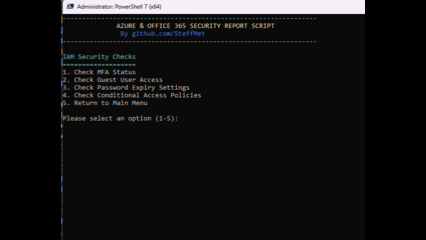

# 🛡️ Azure & Office 365 Security Report

[](https://github.com/PowerShell/PowerShell)
[](https://azure.microsoft.com)
[](https://www.office.com)
[](LICENSE)
[](CONTRIBUTING.md)

> **A comprehensive PowerShell 7 security auditing tool for Azure and Office 365 environments**

This project provides a modular, read-only security assessment script that helps organizations identify security gaps, compliance issues, and cost optimization opportunities across their Azure and Office 365 infrastructure.

## 🌟 Key Features

### 🔐 Azure Security Auditing
- **Identity & Access Management (IAM)**
  - Multi-Factor Authentication (MFA) status analysis
  - Guest user access review and reporting
  - Password expiry policy assessment
  - Conditional Access policy evaluation

- **🛡️ Data Protection**
  - Azure VM TLS configuration analysis (Azure Resource Graph)
  - Virtual Machine disk encryption status
  - Security compliance reporting

### ☁️ Office 365 Security Auditing
- **📊 License Management**
  - Comprehensive license usage analysis
  - Cost optimization recommendations
  - Unassigned license detection and reporting

- **👤 User Account Security**
  - Inactive account detection (90+ days)
  - Licensed but inactive account identification
  - Security risk assessment

- **📧 Email Security**
  - Mailbox forwarding rule analysis
  - External email forwarding detection
  - Exchange Online security assessment

- **👥 Microsoft Teams Security**
  - External access configuration review
  - Teams with external users/guests reporting
  - Teams security posture assessment

## 🚀 Quick Start

### Prerequisites

Ensure you have PowerShell 7.0+ installed:
```powershell
# Check PowerShell version
$PSVersionTable.PSVersion
```

### Installation

1. **Clone the repository:**
   ```bash
   git clone https://github.com/SteffMet/Azure-Office365-Security-Reporting.git
   cd Azure-Office365-Security-Reporting
   ```

2. **Run the launcher script (Recommended):**
   ```powershell
   .\Start-AzureSecurityReport.ps1
   ```
   
   **Or run directly:**
   ```powershell
   # Modular version (recommended)
   .\AzureSecurityReport-Modular.ps1
   ```

3. **Follow the prompts:**
   - The script will automatically check for required modules
   - Install missing modules when prompted
   - Authenticate to Azure and Microsoft Graph
   - Navigate through the security audit menus

## 📋 Required Modules

The script will automatically prompt to install these modules if missing:

```powershell
# Azure modules
Az.Accounts
Az.Compute
Az.Security
Az.ResourceGraph

# Microsoft Graph modules
Microsoft.Graph.Users
Microsoft.Graph.Identity.SignIns
Microsoft.Graph.Reports

# Office 365 modules
ExchangeOnlineManagement
MicrosoftTeams
```

## 🔑 Required Permissions

### Azure AD Roles
- **Recommended**: Global Reader or Security Reader
- **Minimum**: Directory Readers + specific object permissions

### Microsoft Graph API Permissions
```
User.Read.All
Directory.Read.All
Policy.Read.ConditionalAccess
UserAuthenticationMethod.Read.All
Organization.Read.All
Reports.Read.All
AuditLog.Read.All
```

### Office 365 Permissions
- **Exchange Online**: View-Only Organization Management
- **Microsoft Teams**: Teams Administrator (read-only operations)

## 🗂️ Project Structure

```
Azure-Office365-Security-Reporting/
├── 📜 AzureSecurityReport-Modular.ps1      # Main entry point (v3.0)
├── 📁 Modules/
│   ├── AzureSecurityCore.psm1              # Core utilities & authentication
│   ├── AzureSecurityIAM.psm1               # Azure IAM security checks
│   ├── AzureSecurityDataProtection.psm1    # Azure data protection checks
│   └── AzureSecurityOffice365.psm1         # Office 365 security checks
├── � Start-AzureSecurityReport.ps1        # Launcher script (recommended)
├── �🔧 Build-SingleFile.ps1                 # Builds single-file deployment
├── 🎬 MenuLayout.gif                        # Visual menu overview
├── 📋 README.md                            # This file
├── 📝 MIGRATION_NOTES.md                   # Migration from v1.1 to v3.0
└── � AzureSecurityReport_*.log            # Generated log files
```

## 🎯 Usage Examples

### Visual Menu Overview


### Main Menu Navigation
```
Read-Only Azure & Office 365 Security Audit Menu
================================================
1. Identity and Access Management Report (Azure AD)
2. Data Protection Report (Azure)
3. Office 365 Security Report
4. Exit
```

#### 1. Identity and Access Management (IAM) Submenu
```
IAM Security Checks
===================
1. Check MFA Status
2. Check Guest User Access
3. Check Password Expiry Settings
4. Check Conditional Access Policies
5. Return to Main Menu
```

#### 2. Data Protection Submenu
```
Data Protection Security Checks
===============================
1. Check TLS Configuration on VMs (Azure Resource Graph)
2. Check Virtual Machine Encryption
3. Return to Main Menu
```

#### 3. Office 365 Security Submenu
```
Read-Only Office 365 Audit Menu
===============================
1. License Usage Report
2. Inactive Accounts Report
3. Check Mailbox Forwarding Rules
4. Microsoft Teams
5. Return to Main Menu
```

##### 3.4. Microsoft Teams Submenu
```
Microsoft Teams Security Checks
===============================
1. Check External Access Configuration
2. Report Teams with External Users or Guests
3. Return to Office 365 Menu
```

### Sample Output - License Analysis
```powershell
=== LICENSE USAGE SUMMARY ===
Total SKUs: 5
Total unassigned licenses: 25
Estimated monthly savings if optimized: $875

⚠ Microsoft 365 E3: 45 assigned, 15 unassigned (Potential savings: $540/month)
✓ Exchange Online Plan 1: 20 assigned, 0 unassigned

🚨 Critical: 8 inactive accounts have active licenses assigned!
💰 Potential monthly savings: $200 (estimated)
```

### Sample Output - Security Assessment
```powershell
=== TEAMS EXTERNAL ACCESS CONFIGURATION ===
🌐 External Access (Federation): ENABLED
👥 Guest Calling: ENABLED  
📱 External Apps: DISABLED

🛡️ Security Score: 60/100
⚠ Recommendation: Consider restricting external access to improve security posture.
```

## 📊 Report Exports

All findings can be exported to timestamped CSV files:

| Report Type | Filename Format | Contents |
|-------------|----------------|----------|
| License Usage | `License_Usage_Report_YYYYMMDD_HHMMSS.csv` | SKU details, utilization, cost analysis |
| Inactive Accounts | `Inactive_Accounts_Report_YYYYMMDD_HHMMSS.csv` | User details, last sign-in, license status |
| MFA Status | `MFA_Report_YYYYMMDD_HHMMSS.csv` | User MFA configuration, admin accounts |
| Mailbox Forwarding | `Mailbox_Forwarding_Report_YYYYMMDD_HHMMSS.csv` | Forwarding rules, external destinations |
| Teams External Users | `Teams_External_Users_Report_YYYYMMDD_HHMMSS.csv` | Teams with external access |

## 🔧 Advanced Configuration

### Single-File Deployment
Create a standalone script for easy distribution:
```powershell
.\Build-SingleFile.ps1 -OutputPath "AzureSecurityReport-Standalone.ps1"
```

### VSCode Integration
The project includes VSCode configuration for enhanced development:
- PowerShell 7 terminal integration
- Admin script execution tasks
- Debugging configurations

### Custom Module Development
Extend functionality by creating additional modules:
```powershell
# Example: Create a new security module
Import-Module .\Modules\AzureSecurityCore.psm1
# Add your custom security checks here
```

## 🛠️ Troubleshooting

### Microsoft Graph Assembly Conflicts
If you encounter "Assembly with same name is already loaded" errors:

**🔧 Quick Fix Options:**

1. **Use the launcher script (Recommended)**:
   ```powershell
   .\Start-AzureSecurityReport.ps1
   ```

2. **Use the fix script**:
   ```powershell
   .\Fix-GraphModules.ps1
   ```

3. **Manual session restart**:
   ```powershell
   # Exit PowerShell completely
   exit
   
   # Start fresh PowerShell 7 session
   pwsh
   cd "path\to\Azure-Office365-Security-Reporting"
   .\AzureSecurityReport-Modular.ps1
   ```

4. **Automatic restart helper**:
   ```powershell
   .\Restart-PowerShellSession.ps1
   ```

**🔍 Why This Happens:**
Microsoft Graph PowerShell modules use .NET assemblies that can conflict when loaded multiple times in the same session. This is a known limitation of the Microsoft Graph SDK.

### Common Issues

| Issue | Solution |
|-------|----------|
| Module import errors | Run `Install-Module` as Administrator |
| Authentication failures | Verify account permissions and retry |
| CSV export errors | Check file path permissions |
| Graph API rate limits | Wait and retry after a few minutes |

### Performance Optimization

For large tenants (1000+ users):
- Use `-PageSize` parameter where supported
- Run during off-peak hours
- Consider filtering results to reduce data volume

## 🛡️ Security & Compliance

### Read-Only Operations
- ✅ **No modifications** to any Azure or Office 365 configurations
- ✅ **Audit trail** - All actions logged with timestamps
- ✅ **Secure authentication** using modern authentication flows
- ✅ **Least privilege** - Only requires read permissions

### Data Privacy
- 🔒 No sensitive data stored or transmitted
- 🔒 Local CSV exports with configurable file paths
- 🔒 Comprehensive logging for compliance auditing

## 🤝 Contributing

We welcome contributions! Please see our [Contributing Guidelines](CONTRIBUTING.md) for details.

### Development Setup
1. Fork the repository
2. Create a feature branch: `git checkout -b feature/amazing-feature`
3. Make your changes and test thoroughly
4. Commit your changes: `git commit -m 'Add amazing feature'`
5. Push to the branch: `git push origin feature/amazing-feature`
6. Open a Pull Request

### Reporting Issues
- 🐛 [Report bugs](https://github.com/SteffMet/Azure-Office365-Security-Reporting/issues/new?template=bug_report.md)
- 💡 [Request features](https://github.com/SteffMet/Azure-Office365-Security-Reporting/issues/new?template=feature_request.md)
- 📖 [Improve documentation](https://github.com/SteffMet/Azure-Office365-Security-Reporting/issues/new?template=documentation.md)

## 📈 Roadmap

- [ ] **Azure Defender for Cloud** integration
- [ ] **Compliance framework** mapping (ISO 27001, SOC 2, etc.)
- [ ] **PowerBI dashboard** templates
- [ ] **Scheduled execution** with automated reporting
- [ ] **Multi-tenant** support
- [ ] **REST API** integration for third-party tools

## ⚠️ Known Limitations

| Component | Limitation | Workaround |
|-----------|------------|------------|
| VM TLS Checking | Uses Azure Resource Graph metadata analysis, not direct VM inspection | Azure Resource Graph provides VM metadata for intelligent TLS assessment |
| Large Teams Environments | May take time to scan all teams | Progress indicators implemented |
| Audit Log Retention | Limited by tenant audit log settings | Documented in prerequisites |
| Exchange Connection | Requires separate authentication | Automatic connection handling |

## 📞 Support

- 📧 **Issues**: [GitHub Issues](https://github.com/SteffMet/Azure-Office365-Security-Reporting/issues)
- 📖 **Documentation**: [Wiki](https://github.com/SteffMet/Azure-Office365-Security-Reporting/wiki)
- 💬 **Discussions**: [GitHub Discussions](https://github.com/SteffMet/Azure-Office365-Security-Reporting/discussions)

## 📄 License

This project is licensed under the MIT License - see the [LICENSE](LICENSE) file for details.

## 🙏 Acknowledgments

- Microsoft Graph API team for comprehensive security APIs
- PowerShell community for module development best practices
- Azure security community for feedback and testing

---

<div align="center">

**⭐ If this project helps you, please consider giving it a star! ⭐**

Made with ❤️ by [SteffMet](https://github.com/SteffMet)

*Last Updated: June 26, 2025*

</div>
